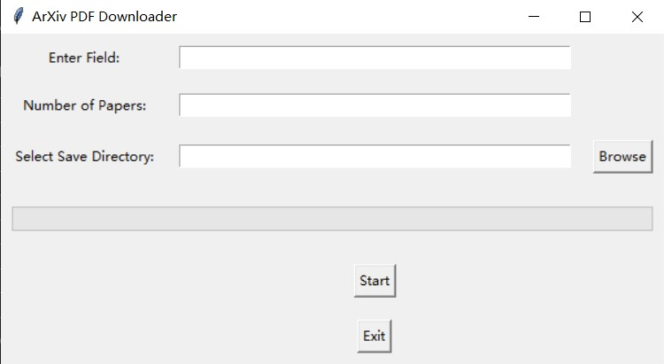

# ArXiv PDF Downloader

ArXiv PDF Downloader 是一个用 Python 编写的图形用户界面 (GUI) 应用程序，它允许用户选择感兴趣的论文领域和需要的论文数量，并将这些论文的 PDF 文件下载到指定的目录。

## 功能

- 用户可以输入感兴趣的领域和需要的论文数量。
- 用户可以选择下载文件的存储路径。
- 应用程序会抓取 ArXiv 上的论文并下载相应的 PDF 文件。
- 实时显示抓取和下载进度。
- 用户可以通过点击按钮关闭窗口。

## 依赖项

- Python 3.x
- tkinter
- requests
- BeautifulSoup4

## 安装

1. 克隆此仓库或下载 ZIP 文件并解压缩：

   ```bash
   git clone https://github.com/yourusername/arxiv-pdf-downloader.git
   cd arxiv-pdf-downloader

2. 安装所需的Python库
   
   pip install requests beautifulsoup4
   更多请见requiments.txt

## 使用方法

1. 运行主程序'main.py'
   
   ```bash
   python main.py

2. 在GUI窗口中操作
   

   
    - 输入感兴趣的论文领域。
    - 输入需要的论文数量。
    - 选择下载文件的存储路径。
    - 点击“Start”按钮开始抓取并下载 PDF 文件。
    - 进度条会实时显示抓取和下载的进度。
    - 点击“Exit”按钮关闭窗口。

## 注意事项
- 确保在具有网络连接的环境中运行此程序，因为需要访问 ArXiv 网站进行抓取和下载。
- 如果遇到下载失败或其他问题，请检查网络连接，并确保所需的 Python 库已正确安装。
- 请注意遵守 ArXiv 的使用政策，不要过于频繁地抓取数据。ArXiv使用政策放置于  [robot.txt](./https___arxiv.org_robots.txt "Robots.txt") 或者也可以运行"download_robots_txt.py" 获取相关政策


## 贡献
   - 欢迎提出问题、建议和贡献代码。您可以通过提交Issue或Pull Request 来参与项目


## 许可证
   - 该项目基于MIT许可证发布。有关详细信息，请参阅LICENSE文件